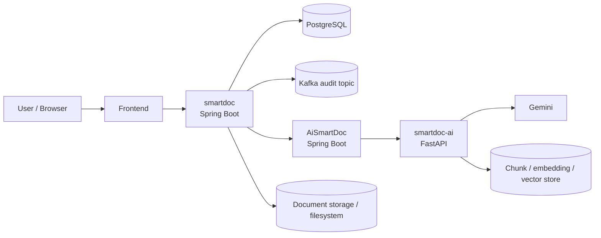
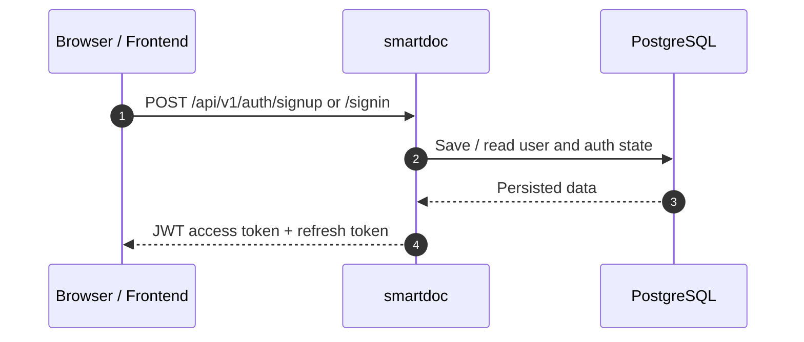
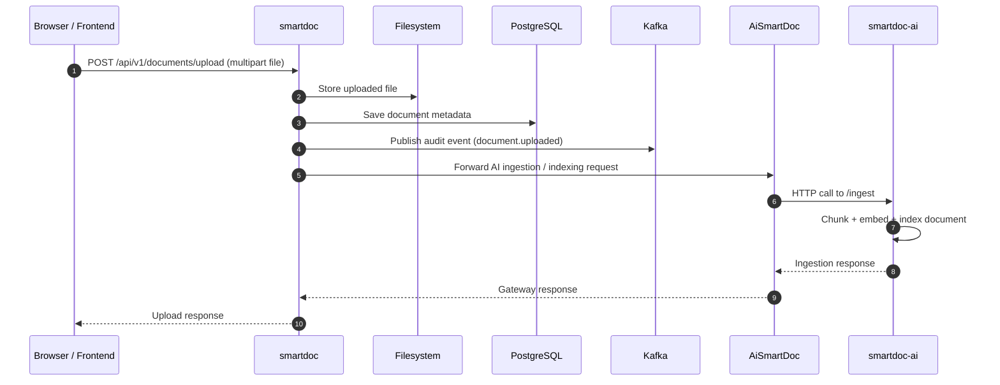
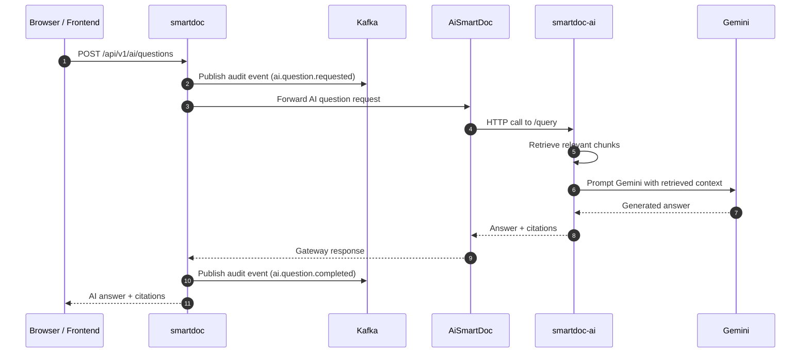
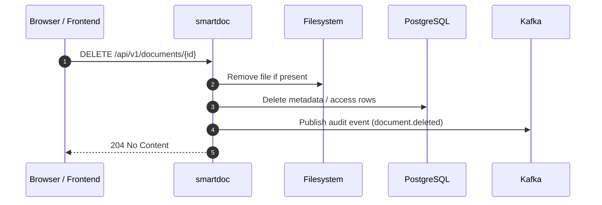

# SmartDoc Communication Architecture

This document explains how data and requests move between the three SmartDoc services and the external systems they rely on.

## 1) High-level view

SmartDoc is split into three main services:

| Service | Technology | Responsibility |
|---|---|---|
| `smartdoc` | Spring Boot / Java | Authentication, user identity, document metadata, API gateway for the frontend, Kafka audit publishing |
| `AiSmartDoc` | Spring Boot / Java | AI gateway between the main backend and the FastAPI RAG engine |
| `smartdoc-ai` | FastAPI / Python | Document chunking, embeddings, retrieval, Gemini response generation |

External systems:

- **PostgreSQL**: primary relational database for `smartdoc`.
- **Kafka**: audit/event stream for traceability.
- **Gemini**: LLM provider used by `smartdoc-ai`.
- **Filesystem / upload storage**: document files stored by the backend.

## 2) Architecture diagram

## 3) Communication responsibilities

### `smartdoc`

Owns the public backend API used by the frontend:

- signup / signin / refresh / signout
- user profile and language endpoints
- document upload, list, delete
- AI-facing endpoint contract exposed to the frontend
- audit events sent to Kafka

It talks to:

- **PostgreSQL** for users, sessions, document metadata, chat history, and other persisted app data.
- **AiSmartDoc** for AI-related operations.
- **Kafka** for audit / trace events.
- **Filesystem** for uploaded document binaries.

### `AiSmartDoc`

Acts as the Spring-based backend-for-backend AI gateway.

It talks to:

- **smartdoc** as the caller-facing AI endpoint for the main backend contract.
- **smartdoc-ai** as the actual RAG / Gemini engine.

It should not own embeddings, chunking, or provider-specific logic.

### `smartdoc-ai`

Owns the retrieval-augmented generation pipeline:

- document ingestion
- chunking
- embeddings
- retrieval
- prompt assembly
- Gemini generation

It should not contain auth, user lifecycle, or frontend logic.

## 4) Main flows

### 4.1 Authentication flow

What happens:

1. The frontend sends credentials to `smartdoc`.
2. `smartdoc` validates the input and stores or reads user data in PostgreSQL.
3. The backend returns JWT-based session tokens.
4. The frontend uses the access token for subsequent requests.

### 4.2 Document upload flow

What happens:

1. The browser uploads a file to `smartdoc`.
2. `smartdoc` stores the file and records metadata.
3. `smartdoc` publishes an audit event to Kafka.
4. `smartdoc` forwards the document to the AI chain for indexing.
5. `AiSmartDoc` sends the ingestion request to `smartdoc-ai`.
6. `smartdoc-ai` chunks the text, creates embeddings, and prepares the document for retrieval.

### 4.3 AI question / answer flow

What happens:

1. The frontend submits a question to `smartdoc`.
2. `smartdoc` records the request in Kafka audit logs.
3. `smartdoc` sends the request to `AiSmartDoc`.
4. `AiSmartDoc` forwards it to `smartdoc-ai`.
5. `smartdoc-ai` retrieves the most relevant chunks and asks Gemini to answer using the retrieved context.
6. The answer, citations, and metadata go back through the gateway chain.
7. `smartdoc` stores / emits the completion audit event.

### 4.4 Delete document flow

## 5) Data storage map

### PostgreSQL

Used by `smartdoc` for:

- users
- roles / auth state
- refresh tokens or session data
- uploaded document metadata
- chat / history projections where applicable

### Filesystem

Used by `smartdoc` for:

- uploaded document binaries
- local development storage

### Kafka

Used as a best-effort audit stream for:

- document uploads
- document deletions
- AI question requests
- AI question completions
- failed AI request traces

Kafka is not the source of truth. It is used for observability and future analytics.

### `smartdoc-ai` internal state

`smartdoc-ai` maintains the RAG pipeline state needed for retrieval:

- document chunks
- embeddings
- retrieval indices / vector store
- conversation context used to build answers

## 6) Trust boundaries

| Boundary | Notes |
|---|---|
| Frontend -> `smartdoc` | Public API boundary, JWT required for protected routes |
| `smartdoc` -> `AiSmartDoc` | Internal backend-to-backend call, protected by shared service token |
| `AiSmartDoc` -> `smartdoc-ai` | Internal service call, should only be reachable by trusted components |
| `smartdoc-ai` -> Gemini | External provider call, provider key required |
| `smartdoc` -> Kafka | Best-effort event publication, must not break user workflows if Kafka is unavailable |

## 7) Endpoint summary

### `smartdoc`

- `POST /api/v1/auth/signup`
- `POST /api/v1/auth/signin`
- `POST /api/v1/auth/refresh`
- `POST /api/v1/auth/signout`
- `GET /api/v1/users/me`
- `PATCH /api/v1/users/me/language`
- `POST /api/v1/documents/upload`
- `GET /api/v1/documents`
- `DELETE /api/v1/documents/{id}`
- `POST /api/v1/ai/questions`
- OpenAPI: `/v3/api-docs`

### `AiSmartDoc`

- `POST /api/v1/ai/questions`
- `POST /api/v1/ai/ingest`
- `GET /api/v1/ai/history`
- `GET /api/v1/ai/health`

### `smartdoc-ai`

- `POST /ingest`
- `POST /query`
- `GET /health`

## 8) Environment variables that matter

### `smartdoc`

- `DB_USERNAME`
- `DB_PASSWORD`
- `APP_JWT_SECRET`
- `KAFKA_BOOTSTRAP_SERVERS`
- `APP_KAFKA_AUDIT_TOPIC`
- `APP_KAFKA_CLIENT_ID`
- `APP_AI_GATEWAY_BASE_URL`
- `APP_AI_GATEWAY_SERVICE_TOKEN`

### `AiSmartDoc`

- `APP_AI_BASE_URL`
- `APP_AI_SERVICE_TOKEN`
- `APP_AI_CONNECT_TIMEOUT_MS`
- `APP_AI_READ_TIMEOUT_MS`

### `smartdoc-ai`

- `GEMINI_API_KEY` or `GOOGLE_API_KEY` or `OPENAI_API_KEY`
- `SERVICE_TOKEN`
- `MODEL_NAME`
- `CHUNK_SIZE_WORDS`
- `CHUNK_OVERLAP_WORDS`
- `RETRIEVAL_TOP_K`

## 9) Short version

- `smartdoc` is the public entrypoint.
- `AiSmartDoc` is the middle gateway.
- `smartdoc-ai` is the AI/RAG engine.
- PostgreSQL stores the app data.
- Kafka stores audit events.
- Gemini generates answers from retrieved chunks.

## 10) Related docs

- [README.md](../README.md)
- [docs/MICROSERVICE_BOUNDARIES.md](MICROSERVICE_BOUNDARIES.md)
- [docs/AGENT_SETUP_ACTIONS.md](AGENT_SETUP_ACTIONS.md)

